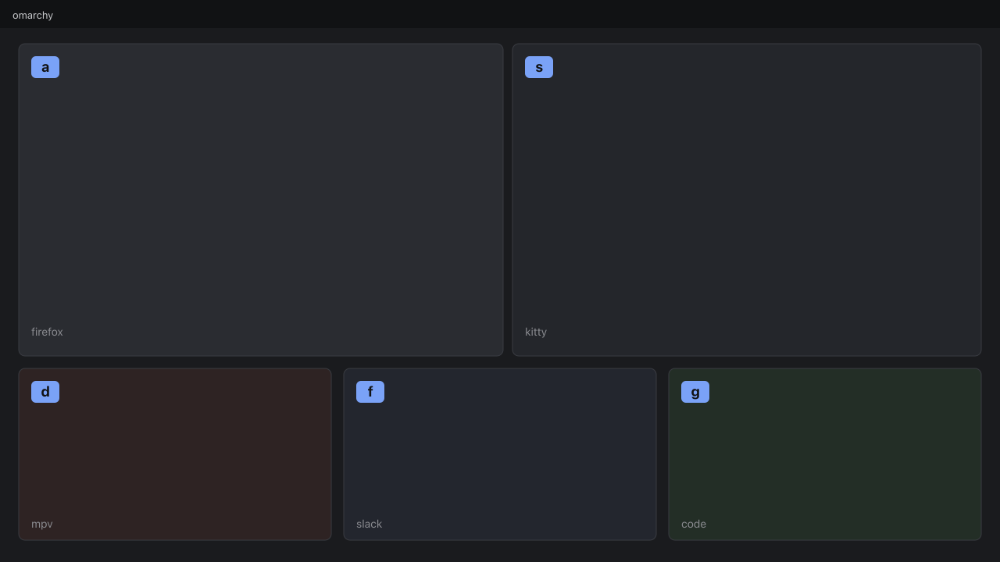

# Window Hints

Vimium for the whole desktop. One hotkey sprinkles avy-style home-row labels over every visible window; type the chord to focus, swap, close, or throw it to a workspace.

This is an Omarchy shell plugin (service + overlay). It runs inside the long-lived `omarchy-shell` process. It does not start a second Quickshell instance.



## Install

```sh
omarchy plugin add <git-url> --enable
```

Then, on the machine, build the helper (optional — QML talks to `hyprctl` directly if the binary is missing):

```sh
~/.config/omarchy/plugins/io.github.chris.window-hints/build.sh
```

Paste `bindings.lua` into `~/.config/hypr/bindings.lua`, or run `hints-ctl submap install` (tries `hyprctl eval`, then a `hyprctl --batch` keyword fallback). Reload plugins if the shell was already running:

```sh
omarchy-shell shell rescanPlugins
```

## Usage

| Chord | Action |
|---|---|
| hint key, then `a` / `sd` / … | Focus that window |
| hint key, then `Shift+chord` | Swap with the focused window (same workspace only) |
| hint key, then `x` then chord | Close — the target flashes danger for 250 ms; `Esc` aborts |
| hint key, then `1`–`9` then chord | Move to workspace N (`movetoworkspacesilent`) |
| `Esc` | Always dismiss (including while a close is armed); always resets the Hyprland submap |

Suggested bind is **Super+F**. If Super+F is already taken, first summon says so and offers **Super+H** / **Super+;**. The plugin never writes your bind file.

```lua
-- ~/.config/hypr/bindings.lua  (full copy in bindings.lua)
hl.bind("SUPER + F", hl.dsp.exec_cmd("omarchy-shell shell toggle io.github.chris.window-hints '{}'"))
```

The `hints` submap is the load-bearing input path. Chord keys are sent to the plugin’s registered IPC target `window-hints` (`omarchy-shell window-hints key a`), not through `shell call <plugin-id>` (that would hit the overlay and must not bounce). Summon activates `submap hints` only after install reports `installed:true`. If install fails, the overlay takes exclusive keyboard focus until bindings exist so a cold judge is never inputless; a banner tells you to paste `bindings.lua`. Recovery is `hyprctl dispatch submap reset`. Setting `inputPath: "overlay"` forces exclusive overlay keys even when the submap is installed.

## IPC

```sh
omarchy-shell shell toggle io.github.chris.window-hints '{}'
omarchy-shell shell summon io.github.chris.window-hints '{}'
omarchy-shell shell hide io.github.chris.window-hints
omarchy-shell window-hints key a
omarchy-shell shell call io.github.chris.window-hints status '{}'
```

## Settings

Inline on the `shell.json` plugin entry. No config file of our own.

```json
{
  "id": "io.github.chris.window-hints",
  "inset": 8,
  "maxHints": 25,
  "watchdogMs": 15000,
  "armMs": 250,
  "inputPath": "submap",
  "suggestedBind": "SUPER+F"
}
```

Chords use a **fixed** home-row alphabet `asdfghjkl` (v1.0). `x` and `1`–`9` are reserved verbs, not chords. `inputPath: "overlay"` is an optional latency enhancement (exclusive overlay focus). Leave it at `"submap"` for the compositor-grabbed path.

## Honest limitations

- **Windows only.** Bar-widget hinting needs shell internals; not in 1.0. Other-workspace gutter (`Tab`) is v1.1.
- **Swap is same-workspace only.** Cross-workspace swap is not a swap (it would take two `movetoworkspacesilent` and wreck both layouts). If this Hyprland's `swapwindow` is directional-only, the Shift+chord verb is greyed rather than surprising you.
- **25 visible windows (or chord capacity, whichever is smaller).** Beyond that, a "+N more" chip; extra windows are not hinted.
- **Label freeze.** A window that closes mid-hint loses its label; that chord is never reused. New windows opening mid-hint are ignored until the next summon.
- **Keybinds are yours to add.** First summon shows the table and, if Super+F collides, the alternates. Generated `hints-ctl submap install|script` uses the live `suggestedBind` (not a hardcoded Super+F). On Hyprland 0.55, `hyprctl keyword` may refuse to install the submap at runtime — paste `bindings.lua`. Until that install succeeds, the overlay keeps exclusive keys.
- **Helper binary.** `bin/hints-ctl` is built by `build.sh`. If it is missing, QML uses `compat/hints-ctl.sh` and raw `hyprctl`. Submap *definition* may need the Lua snippet; summon does **not** enter an undefined `hints` submap.
- **Timeouts.** Every live `hyprctl` from the service is a queued `Process` with an 800 ms timeout and an error toast. The helper’s own `hyprctl` children use the same 800 ms cap (or `timeout 1` in the POSIX fallback). `Hyprland.dispatch` is used only on teardown, where we cannot wait, plus `execDetached hyprctl dispatch submap reset`. The 15 s idle watchdog still dismisses the overlay and resets a live submap. Disable / unload / hot-reload runs `Component.onDestruction` cleanup (stop timers and processes, `submap reset`).
- **Coordinates.** Mapping is logical-coords only (no `* scale`). Rotated outputs that already report swapped width/height are subtracted; a pre-transform JSON is rotated in `globalToOutput`. If geometry looks unusable, labels fall back to a per-monitor gutter with titles.

## Tests (off-device)

```sh
node tests/run.js
sh tests/helper-fallback.test.sh
# helper, if you have cargo:
cargo test --manifest-path src/hints-ctl/Cargo.toml
```

## Remove

```sh
omarchy plugin remove io.github.chris.window-hints
```
